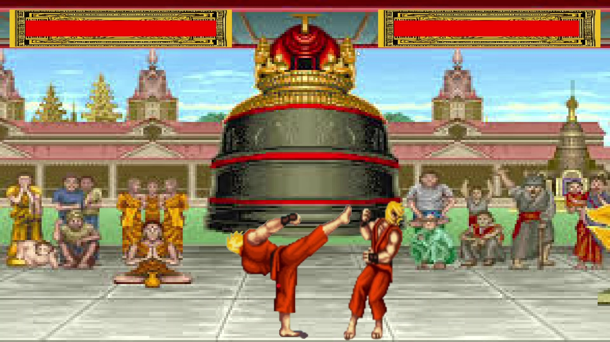
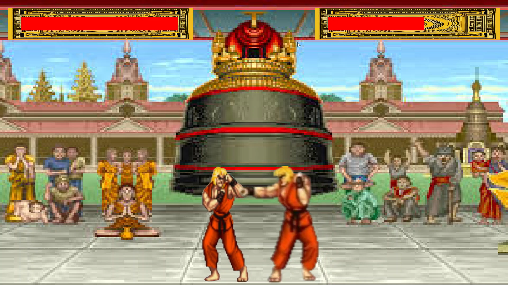

# 2D Fighting Game  

A simple **2-player fighting game** built in **C++** using the **SDL2** library. This project focuses on **object-oriented programming (OOP)** principles and was developed for educational purposes.  

## Features  
 - Customizable game window size  
 - Separate controls for each player:  
   - **Player 1:** `WASD` (movement), `E R T` (punch, kick, block)  
   - **Player 2:** `Arrow keys` (movement), `KP1 KP2 KP3` (punch, kick, block)  
 - Player actions:  
   - Move left/right  
   - Jump and crouch  
   - Attack (punch/kick) and block  
 - Collision detection and hit validation  
 - Health bar display for both players  
 - Real-time position updates and animations with **4 states**:  
   - **Idle**  
   - **Crouch**  
   - **Punch**  
   - **Kick**  
   - **Block**  
 - Dynamic player direction updates based on movement  

## Setup & Build Instructions  
### Prerequisites  
- **Visual Studio 2022**
- **SDL2 library** (must be installed)  

### Steps to Build  
1. Clone this repository:  
   ```sh
   git clone https://github.com/yourusername/2D-Fighting-Game.git
   cd 2D-Fighting-Game
   ```
2. Install **SDL2** (if not already installed).  
3. Open the project in **Visual Studio 2022**.  
4. Build and run the project.  

## 🎮 Controls  
| Action  | Player 1 | Player 2 |
|---------|---------|---------|
| Move Left  | `A` | `Left Arrow` |
| Move Right | `D` | `Right Arrow` |
| Jump | `W` | `Up Arrow` |
| Crouch | `S` | `Down Arrow` |
| Punch | `E` | `KP1` |
| Kick | `R` | `KP2` |
| Block | `T` | `KP3` |

## 📷 Screenshots  
 
   
